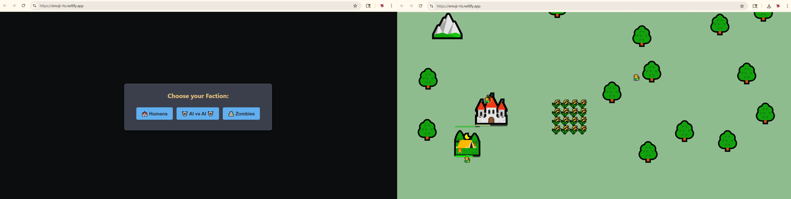

# Emoji RTS - A Simple Real-Time Strategy Game

This is a browser-based Real-Time Strategy (RTS) game built with HTML, CSS, and vanilla JavaScript, featuring emoji-based units and buildings. The project demonstrates core RTS mechanics and a custom JavaScript-driven menu system.

[Emoji-RTSo](https://emoji-rts.netlify.app/)

## Current Features

*   **Two Playable Factions:** Humans (🏰) and Zombies (🏯) with unique emoji sets (though currently sharing similar unit/building stats).
*   **Resource Gathering:** Workers can harvest Wood (🪵) from Trees (🌳/🌲) and Coal (⛏️) from Mines (⛰️).
*   **Base Building:**
    *   Workers can construct Farms (🌾/🍖) for food capacity.
    *   Barracks (⛺/🕳️) to train soldier-type units.
    *   Archery Ranges (🏭/🕋) to train archer-type units.
    *   Guard Towers (🗼/⛩) for base defense (basic auto-attack implemented).
*   **Unit Training:**
    *   Bases train Workers.
    *   Barracks train Soldiers.
    *   Archery Ranges train Archers.
*   **Combat:**
    *   Soldiers and Archers can attack enemy units and buildings.
    *   Basic attack-move and right-click context actions.
    *   Guard Towers automatically attack nearby enemies.
*   **UI:**
    *   Resource display (Wood, Coal, Food/Food Capacity).
    *   Selection information panel.
    *   Custom JavaScript-driven menu system (`JSRTSMenu`) for:
        *   **Command Cards:** Contextual actions for selected units/buildings.
        *   **Context Menus:** Right-click actions on the game world or entities.
        *   Features include submenus, icons, cost display, tooltips, and cooldown visuals.
    *   Modal dialogs for game start and main menu.
*   **Game Modes:**
    *   Human vs. AI.
    *   AI vs. AI (for observation).
*   **Camera Controls:**
    *   Panning with WASD/Arrow Keys.
    *   Zooming with mouse wheel.
*   **Debug Panel:** Toggleable with the backtick key (` ` `) to show game state information.
*   **Game Over Condition:** Destruction of a faction's main base.

## Project Structure

The game is organized into the following files:

*   `index.html`: The main HTML file that structures the page and loads scripts.
*   `style.css`: Contains all CSS rules for styling the game and UI elements.
*   `js/`: Directory for JavaScript files:
    *   `menu.js`: Contains the `JSRTSMenu` class and `CooldownManager` for handling all in-game menus.
    *   `game-data.js`: Stores static game data like world constants, unit/building stats (`FACTION_DATA`), and icon mappings.
    *   `game-state.js`: Manages all dynamic global state variables of the game (e.g., player resources, entity arrays, selection state).
    *   `game-logic.js`: The core game engine, responsible for simulations, entity behaviors (movement, combat, harvesting, construction), AI decision-making, and the main game loop.
    *   `main.js`: The main entry point. Initializes the game, sets up DOM element references, binds all event listeners (user input, UI interactions), and contains JSRTSMenu builder functions and UI update logic.

## How to Play

1.  Open `index.html` in a modern web browser.
2.  Choose a faction (Humans or Zombies) or select "AI vs AI" mode from the start modal.
3.  **Controls (Human Player):**
    *   **Left-Click:** Select units/buildings, confirm building placement.
    *   **Right-Click:**
        *   On ground: Move selected unit(s).
        *   On enemy: Attack-move selected unit(s).
        *   On resource (with worker): Harvest resource.
        *   (Other context-specific actions may appear in a menu).
    *   **Mouse Wheel:** Zoom in/out.
    *   **WASD / Arrow Keys:** Pan the camera.
    *   **Escape Key:** Deselect units/buildings, cancel placement, or open the Main Menu.
    *   **Hotkeys:** (Refer to command card tooltips for specific action hotkeys. Some global hotkeys exist, e.g., 'B' for worker build menu).
    *   **Backtick (` ` `):** Toggle the debug panel.

## Known Issues / Areas for Future Development (as of this version)

*   **Hotkey Refinement:** Some global hotkeys may not be fully implemented or may conflict.
*   **Unit Pathfinding:** Basic movement; units may clip or block each other.
*   **AI Sophistication:** AI is currently very basic in its strategy and decision-making.
*   **Combat Balancing:** Unit and building stats may not be balanced.
*   **Visual Polish:** Limited animations and visual effects.
*   **Sound Effects:** Not yet implemented.
*   **Map Editor:** Conceptual, not yet implemented.
*   **No Save/Load Functionality.**

## Development Notes

This project uses vanilla JavaScript, HTML, and CSS. It does not rely on external game engines or libraries beyond the custom `JSRTSMenu` component. The code is structured to separate concerns into data, state, logic, and UI/input handling.
